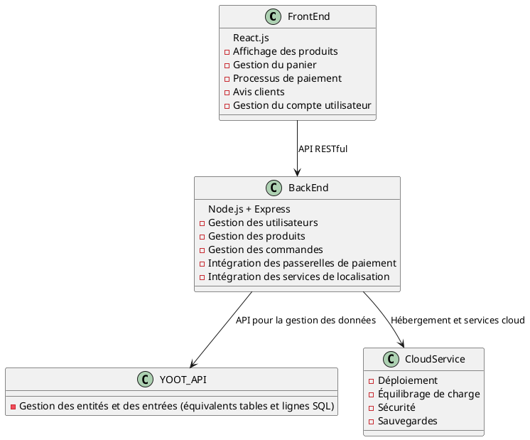

Merci pour ces précisions. En tenant compte des spécificités de YOOT Entreprise et de l'utilisation prévue de leur API pour une application e-commerce, nous allons élaborer une architecture logicielle adaptée.

### Contexte Initial

= SPEC-1: Solution e-commerce pour YOOT Entreprise
:sectnums:
:toc:

== Contexte

YOOT Entreprise est un CMS minimaliste axé sur la simplicité et la facilité d'utilisation. Il vise à fournir un moyen rapide pour les propriétaires d'entreprises axées sur le contenu et leurs développeurs de gérer le stockage pour leurs applications. YOOT offre une interface Web conviviale pour gérer les données, ainsi qu'une API qui expose ces données à des applications externes. Ce document se concentre uniquement sur l'utilisation de l'API.

Un projet, dans les termes de YOOT, correspond à une base de données. Le projet est créé sur la console et, à l'intérieur du projet, se trouvent des entités comparables aux tables SQL. Ces entités contiennent finalement des entrées comparables aux lignes d'une base de données SQL.

== Exigences

1. **Public cible et portée**
   - L'application e-commerce cible principalement le B2C avec la possibilité d'extension au B2B à l'avenir.
   - Elle doit être évolutive pour répondre aux besoins d'une grande entreprise internationale.

2. **Fonctionnalités spécifiques**
   - Authentification des utilisateurs.
   - Passerelles de paiement intégrées (par exemple, Stripe, PayPal).
   - Services de localisation pour la gestion multilingue et multidevise.
   - Gestion des produits, des avis clients et des commandes.
   - Interface utilisateur intuitive et responsive pour desktop et mobile.

### Méthode

== Architecture Technique

Pour répondre aux exigences mentionnées, nous proposons l'architecture suivante pour l'application e-commerce :

1. **Front-End**
   - **Technologies** : SVELTE 
   - **Fonctionnalités** : Affichage des produits, gestion du panier, processus de paiement, avis clients, gestion du compte utilisateur.

2. **Back-End**
   - **Technologies** : Node.js avec Express pour une API RESTful.
   - **Fonctionnalités** : Gestion des utilisateurs, des produits, des commandes et des avis. Intégration avec les passerelles de paiement et les services de localisation.
   - **Intégration** : Utilisation de l'API de YOOT pour la gestion des données (produits, utilisateurs, commandes).

3. **Base de Données et Stockage**
   - **Technologies** : Utilisation de l'API YOOT pour la gestion des entités et des entrées (équivalents des tables et lignes SQL).
   - **Fonctionnalités** : Stockage des données des utilisateurs, produits, commandes et avis.

4. **Serveur**
   - **Technologies** : Hébergement sur un service cloud (AWS, Azure, ou Google Cloud) pour une évolutivité et une gestion facile.
   - **Fonctionnalités** : Déploiement des services front-end et back-end, équilibrage de charge, gestion de la sécurité et des sauvegardes.

== Schéma de l'Architecture

Voici un diagramme illustrant les composants principaux de l'architecture :

== Mise en œuvre

Les étapes suivantes sont nécessaires pour mettre en œuvre cette architecture :

1. **Développement Front-End**
   - Configurer un projet React.js.
   - Développer les composants d'interface utilisateur.
   - Intégrer l'API backend pour les opérations CRUD.

2. **Développement Back-End**
   - Configurer un projet Node.js avec Express.
   - Développer les points d'API pour la gestion des utilisateurs, des produits, des commandes et des avis.
   - Intégrer l'API YOOT pour la gestion des données.

3. **Déploiement**
   - Configurer l'infrastructure cloud pour l'hébergement.
   - Déployer les services front-end et back-end.
   - Configurer les passerelles de paiement et les services de localisation.

== Jalons

1. **Semaine 1-2** : Conception et configuration initiale des projets front-end et back-end.
2. **Semaine 3-4** : Développement des fonctionnalités principales de l'interface utilisateur.
3. **Semaine 5-6** : Développement des points d'API et intégration avec l'API YOOT.
4. **Semaine 7-8** : Tests et débogage.
5. **Semaine 9-10** : Déploiement et configuration des services cloud.
6. **Semaine 11-12** : Tests finaux et mise en production.

== Collecte des résultats

Pour évaluer si les exigences ont été correctement adressées et évaluer la performance du système après la mise en production, nous utiliserons les indicateurs suivants :

1. **Performance** : Temps de réponse de l'application, temps de chargement des pages.
2. **Satisfaction des utilisateurs** : Retours des utilisateurs sur l'interface et les fonctionnalités.
3. **Fiabilité** : Disponibilité du système, gestion des erreurs et des pannes.

Cela constitue le cadre de la solution que nous proposons pour YOOT Entreprise. Est-ce que vous avez des commentaires ou des ajustements à apporter avant de continuer ?